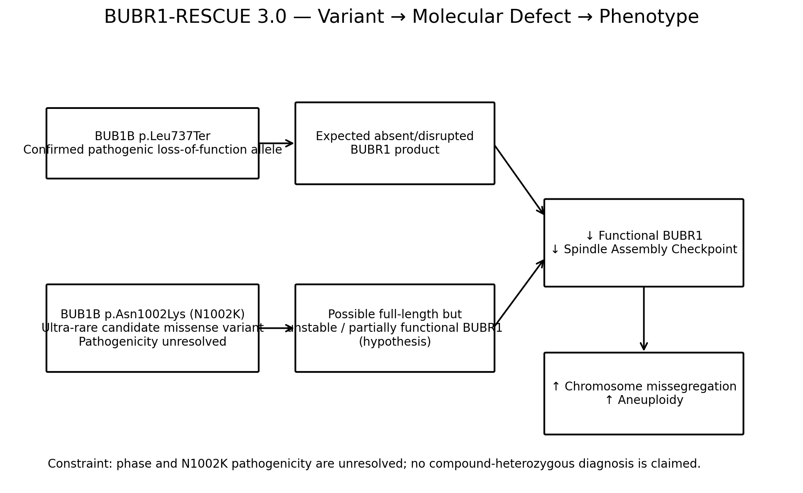
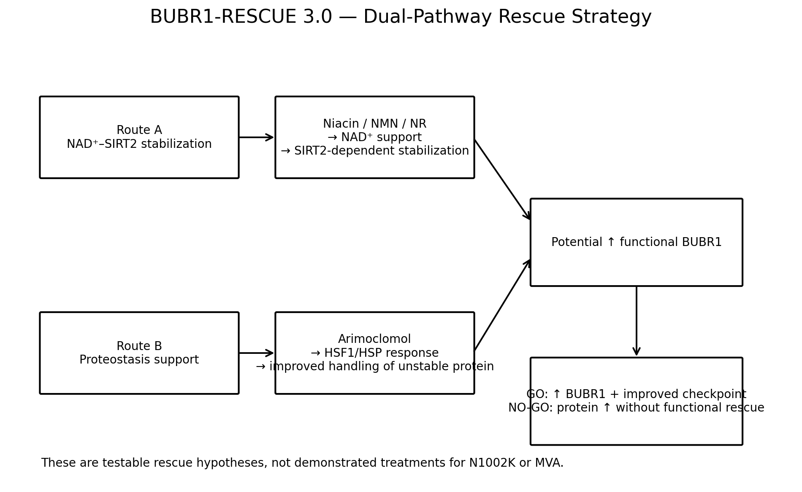
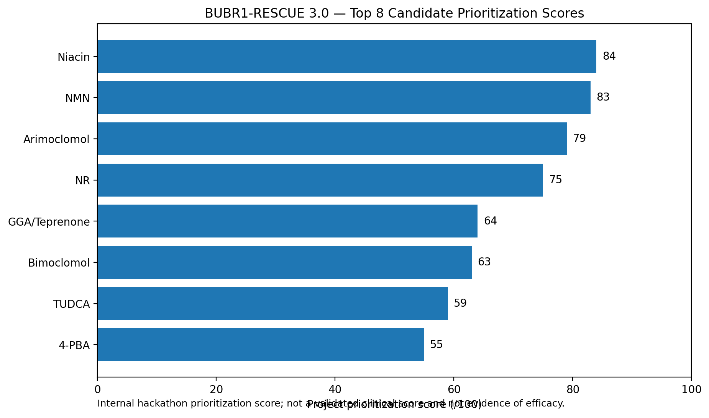

# BUBR1-RESCUE 3.0

**Genotype-guided drug repurposing framework for BUB1B/BUBR1-associated Mosaic Variegated Aneuploidy (MVA)**  
Rare Disease Real Kid Hackathon 2026 — Track 2

---

## Project overview

BUBR1-RESCUE 3.0 is a computational and literature-guided framework designed to prioritize **testable molecular rescue hypotheses** for BUB1B/BUBR1-associated Mosaic Variegated Aneuploidy (MVA).

This project builds on an earlier submission by adding:

- variant-level rescue reasoning,
- deeper structural interpretation,
- a reproducible 20-candidate drug screen,
- explicit evidence for and against each strategy,
- a dual-pathway rescue model,
- transparent limitations,
- and a falsifiable Go/No-Go validation plan.

No wet-lab rescue experiment was completed.

---

## Core genomic interpretation

### p.Leu737Ter

- Gene: **BUB1B**
- Protein consequence: **p.Leu737Ter**
- Interpretation: established pathogenic loss-of-function allele
- Expected consequence: absent or disrupted BUBR1 product

### p.Asn1002Lys / N1002K

- Gene: **BUB1B**
- Protein consequence: **p.Asn1002Lys**
- Interpretation: ultra-rare candidate missense variant
- Location: C-terminal kinase-like/pseudokinase region
- Pathogenicity: **unresolved**
- Phase relative to p.Leu737Ter: **unresolved**

The project does **not** claim a confirmed compound-heterozygous diagnosis from these two variants alone.

---

## Variant-to-phenotype model



The working model is:

**Reduced functional BUBR1**  
→ weakened spindle assembly checkpoint  
→ increased chromosome missegregation  
→ increased aneuploidy

For N1002K, the specific hypothesis is that the variant may produce a **full-length but unstable or partially functional BUBR1 protein**. This remains unproven.

---

## Key conceptual advance

BUBR1-RESCUE 3.0 separates two questions that are often conflated:

### 1. Variant causality

How strong is the evidence that a variant contributes to disease?

### 2. Molecular rescuability

If the variant is biologically relevant, is there evidence that residual protein abundance or function could be increased?

This distinction allows the project to generate a **falsifiable rescue hypothesis without overstating pathogenicity**.

---

## Dual-pathway rescue strategy



### Route A — NAD⁺–SIRT2-mediated stabilization

Candidate strategies:

- **Niacin** — primary repurposing hypothesis
- **NMN** — mechanistic benchmark
- **Nicotinamide riboside (NR)** — backup NAD⁺ strategy

Rationale:

NAD⁺-dependent SIRT2 biology has been linked to BUBR1 stability and abundance. This creates a mechanistically grounded route for testing whether increased NAD⁺ support could improve BUBR1 abundance.

### Route B — Proteostasis support

Primary candidate:

- **Arimoclomol** — orthogonal repurposing hypothesis

Rationale:

MVA-associated BUBR1 missense proteins can show reduced stability and dependence on heat-shock machinery. Arimoclomol therefore provides an independent rescue route centered on proteostasis rather than NAD⁺ metabolism.

---

## Systematic drug screen

Twenty candidate compounds or strategies were prioritized using a transparent 100-point framework.



### Current top priorities

| Candidate | Role | Score |
|---|---|---:|
| Niacin | Primary repurposing hypothesis | 84 |
| NMN | Mechanistic benchmark | 83 |
| Arimoclomol | Orthogonal repurposing hypothesis | 79 |
| Nicotinamide riboside | Backup NAD⁺ strategy | 75 |

The complete ranking is available in:

[`data/drug_candidate_ranking.csv`](data/drug_candidate_ranking.csv)

The scoring method is documented in:

[`docs/drug_ranking_method.md`](docs/drug_ranking_method.md)

These scores are **not clinical efficacy scores** and do not demonstrate treatment benefit.

---

## Why negative candidates are included

The framework intentionally keeps compounds that score poorly or are mechanistically unfavorable.

For example:

- **Geldanamycin** is retained as a contra-mechanistic example because HSP90 inhibition is expected to worsen the stability of unstable BUBR1 missense proteins.
- **MG132** is treated as a research tool rather than a repurposing candidate.
- **4-PBA** is retained as a comparator rather than a lead.

This helps demonstrate that the framework is capable of **rejecting candidates**, not only selecting them.

---

## Go / No-Go validation logic

A future experiment should test both **molecular rescue** and **functional rescue**.

### GO

A candidate advances only if it produces:

1. increased BUBR1 abundance or stability, **and**
2. improved spindle-checkpoint / chromosome-segregation function.

### NO-GO

A candidate should not advance if:

- BUBR1 abundance rises without functional rescue,
- no meaningful molecular effect occurs,
- or the intervention worsens checkpoint function or chromosome segregation.

---

## Evidence graph

A concise mechanistic map is available here:

[`docs/evidence_graph.md`](docs/evidence_graph.md)

---

## Limitations

The project explicitly does **not** claim that:

- N1002K is proven pathogenic,
- p.Leu737Ter and N1002K are confirmed to be in trans,
- niacin rescues N1002K,
- arimoclomol rescues N1002K,
- NMN treats MVA,
- any candidate improves the patient's phenotype,
- laboratory rescue was demonstrated.

Full limitations are documented in:

[`docs/limitations.md`](docs/limitations.md)

---

## Repository structure

```text
BUBR1-RESCUE-3.0/
├── data/
│   └── drug_candidate_ranking.csv
├── docs/
│   ├── evidence_graph.md
│   ├── drug_ranking_method.md
│   └── limitations.md
├── figures/
│   ├── figure_1_variant_to_phenotype.png
│   ├── figure_2_dual_pathway_rescue.png
│   └── figure_3_top8_ranking.png
├── results/
├── submission/
└── README.md
```

---

## Key references

- North BJ, et al. **SIRT2 induces the checkpoint kinase BubR1 to increase lifespan.** *EMBO Journal.* 2014. PMID: 24825348.
- Hara N, et al. **Elevation of cellular NAD levels by nicotinic acid and involvement of nicotinic acid phosphoribosyltransferase in human cells.** *Journal of Biological Chemistry.* 2007. PMID: 17604275.
- **Molecular causes for BUBR1 dysfunction in Mosaic Variegated Aneuploidy.** PMCID: PMC2887387.
- U.S. FDA. **Miplyffa (arimoclomol) approval for Niemann-Pick disease type C.** 2024.

---

## Status

**BUBR1-RESCUE 3.0 is a second-submission candidate.**  
The original submission remains unchanged.

This repository represents ongoing refinement designed to improve scientific rigor, transparency, reproducibility, and scalability before any new hackathon submission is made.

